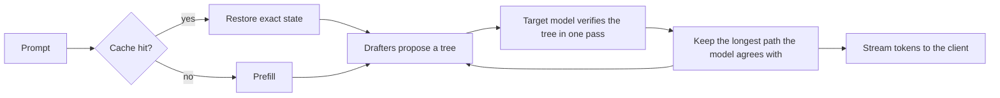

# TandemLLM

TandemLLM is an inference engine for Qwen3.8-27B on one NVIDIA DGX Spark. With the published NVFP4 weights and StairCut on, it writes about 50 tokens a second for one request. Plain greedy decoding on the same box runs at 13.69 tok/s. The text is the model's own greedy text, with one documented exception: where the two best tokens are within one unit in the last place (ulp), the batched verify can round the other way ([docs/exactness.md](docs/exactness.md)).

TandemLLM is a working name, and it says how the engine works. Small drafters guess the next 7 to 15 tokens, and the big model checks all the guesses in one pass. A guess the model agrees with is a free token. At the first wrong guess the model puts in its own token, so nothing a drafter does reaches the output.

## Paper

StairCut, the router that sizes the draft tree each round, is described in:

> Khaled Bakeer. *StairCut: sizing speculative draft trees on a measured verification-cost staircase.* 2026. arXiv: `TODO`. Zenodo: `TODO`.

The paper measured commit `431ddee` on branch `router-eng169`. StairCut is on `main` from merge commit `c111fa7`, behind flags that are off by default and on in `ops/serve.env`. On the benchmark row below, with the published NVFP4 weights and the persistent lookup store off, the paper reports these means over 50 requests:

| configuration | tok/s |
|-|-|
| StairCut | 49.89 |
| fixed block 8 (the narrow drafter alone) | 47.13 |
| fixed block 16 (the wide drafter alone) | 44.80 |
| plain greedy decoding | 13.69 |

[CITATION.cff](CITATION.cff) has the citation.

## Results

We ran one request at a time on one DGX Spark, against vLLM with its best speculative decoding on the same box. These rows predate StairCut and the published weights; the Paper section above has the newer numbers.

| weights | TandemLLM | vLLM 0.27.1, best speculation | speed-up |
|-|-|-|-|
| FP8, the vendor checkpoint | 28.4 tok/s | 15.57 tok/s (MTP, 3 tokens) | 1.82x |
| NVFP4 | about 44 tok/s | 25.71 tok/s (best of MTP 2, MTP 3, n-gram) | 1.71x |

How we measured:

- The workload is `serve-single-i256-o256-v1`: 256 prompt tokens, 256 generated tokens, thinking off, temperature 0, seed 42. It sends 50 requests after 3 warm-ups, one at a time, through the same bench runner and the same prompts for both engines.
- A request's speed is `(completion_tokens - 1) / (end-to-end time - time to first token)`. The table shows the mean over the 50 requests.
- vLLM ran as its 0.27.1 container with default settings except the memory share (0.82 for FP8, 0.78 for NVFP4). We tried MTP at 2 and 3 tokens and the n-gram method, and the table shows the fastest.
- TandemLLM ran with its lookup store off, so none of the benchmark's own text could help it. Its release gate also runs every row with a clean store, one that never held the benchmark's text. On the NVFP4 profile the two views agree to within 1 %.
- The two NVFP4 rows do not read the same weights. vLLM reads a published NVFP4 export of the model. TandemLLM reads its own quantised set: MLP, GDN and attention projections at NVFP4 and the output head at FP8 (e4m3). Our quality gate scores ours against the FP8 checkpoint, and [docs/quantisation.md](docs/quantisation.md) has the numbers.
- These are single-request numbers. Parallel requests and long prompts are not in this table.

[docs/measurement.md](docs/measurement.md) explains the method. It also explains why every change runs against the current release in the same hour, 50 requests a side, before it ships.

## What makes it fast

A decode step of a 27B model reads every weight once, and on this board that read is the cost: 15 GB at NVFP4, against about 240 GB/s the GPU can read. The engine does two things about it. It cuts the bytes a step reads, and it makes each step produce about 4 tokens instead of one.



The parts:

- Weights. The loader reads the vendor's FP8 checkpoint as it lies on disk. A quantiser writes NVFP4 copies of the projections, and a quality gate decides whether they ship.
- Kernels. Our own Triton and CUDA kernels run the 4-bit and 8-bit matrix products and the recurrent layers. A row gets the same bits whatever other rows share the batch, up to 32 rows.
- Speculation. Two DFlash2 block drafters (one guesses 7 tokens, one 15), a lookup drafter that copies from the conversation and a text corpus, and a router that picks the block length once per request. StairCut (`QWEN38_LEN_SWITCH=1 QWEN38_LEN_MODE=wide`, off in the code, on in `ops/serve.env`) instead cuts every round's tree to the size that maximises expected tokens per millisecond on the measured verify cost; [docs/speculative-decoding.md](docs/speculative-decoding.md) describes it and its flags. The guesses form a tree, and the model verifies the whole tree through all 64 layers, recurrent ones included.
- Caches. The next turn of a conversation resumes from the state the last one left, with no re-reading. Each restore gives back the exact bytes.
- Server. An OpenAI-compatible API. Tool calls come back typed by their JSON schema, structured outputs stay exact under speculation, and a long prefill stops when the client leaves.
- Dashboard. The engine serves its own web page. It shows what each request is doing right now (prefilling at 76 %, thinking, calling `write_file`), and keeps a year of speed and usage.

Start with [docs/architecture.md](docs/architecture.md), a one-page tour. Each of the 12 pages in [docs](docs/README.md) covers one part.

## Install

One command sets up the served profile, StairCut included, on a DGX Spark:

```bash
curl -fsSL https://raw.githubusercontent.com/0xBakeer/TandemLLM/main/install.sh | bash
```

[install.sh](install.sh) first checks the board: GPU, driver, CUDA compiler, about 70 GB of free disk and 64 GiB of free memory to start. It clones the engine at the paper's release (`v0.2.0-staircut`) into `~/TandemLLM/src` and builds a venv with pinned packages. The base checkpoint, the NVFP4 weights and both drafters go to the Hugging Face cache. The config is `~/TandemLLM/run/ops/serve.env`, the release's `ops/serve.env` with this machine's paths. Then it starts the engine, waits for `/health`, runs a smoke test that prints tok/s, and shows how to point an OpenAI client or opencode at it. Run it again to update: it skips finished steps, and downloads resume where they stopped.

| flag | what |
|-|-|
| `--dir DIR` | install directory, default `~/TandemLLM` |
| `--port PORT`, `--host ADDR` | where the API listens, default `127.0.0.1:8000` |
| `--ref REF` | the engine version to check out (any git ref), default `v0.2.0-staircut` |
| `--hf-token TOKEN` | a Hugging Face token (`HF_TOKEN` works too) |
| `--no-corpus` | skip the lookup corpus |
| `--no-start` | install and configure, don't start |
| `--systemd` | also install a systemd user unit, `tandemllm.service` |
| `--yes`, `--dry-run`, `--uninstall` | non-interactive, print the steps only, remove the install |

Afterwards, `~/TandemLLM/bin/tandem start|stop|status|smoke|logs` controls the engine.

The installer builds its lookup corpus from public text: one English and one German Wikipedia shard, plus Python sources from the venv's own packages, about 31 million tokens. The served corpus is not published, and the paper's numbers come from it. With the installer's corpus, or with `--no-corpus`, the lookup drafter proposes different continuations, so speeds can differ from the paper's. We haven't measured by how much. Other CUDA GPUs are best effort: the installer turns off the sm_121a-only skinny kernel there, and StairCut's cost tables come from the Spark.

## Quick start

You need a DGX Spark (GB10 GPU, 128 GB of memory shared by CPU and GPU) with Linux, Python 3.11 or newer, PyTorch 2.13 with CUDA 13.0 (and its compiler, for the one kernel that builds on first use), Triton 3.7, transformers 5.12, safetensors and numpy. The engine needs no other package. Run one engine per board: two engines loading side by side run the board out of memory.

The quickest path uses the published weights and drafters:

```bash
hf download Qwen/Qwen3.8-27B-FP8
hf download 0xBakeer/TandemLLM-Qwen3.8-27B-NVFP4 --local-dir ~/tandem/nvfp4
hf download 0xBakeer/TandemLLM-Qwen3.8-27B-DFlash2-b8 --local-dir ~/tandem/ft-b8
hf download 0xBakeer/TandemLLM-Qwen3.8-27B-DFlash2-b16 --local-dir ~/tandem/ft-b16
```

Then edit the path lines at the top of `ops/serve.env` to match your machine: `REPO` (this checkout), `PY` (a Python with the packages above), `NV=~/tandem/nvfp4/mlp.safetensors,~/tandem/nvfp4/gdn.safetensors,~/tandem/nvfp4/attn.safetensors`, `HEAD=~/tandem/nvfp4/head-fp8.safetensors`, `CKPT8=~/tandem/ft-b8`, `CKPT16=~/tandem/ft-b16` and `CORPUS`. Start it with `bash ops/start.sh`. That is the served profile, StairCut included.

To build the weights yourself instead, download the checkpoint and the released block drafter:

```bash
hf download Qwen/Qwen3.8-27B-FP8
hf download z-lab/Qwen3.8-27B-DFlash2
```

Build the NVFP4 weights and the FP8 head, then gate them:

```bash
python tools/quant_nvfp4.py stats --corpus bench/calib.txt --out ~/nvfp4/stats-all.pt --tokens 8192
for t in mlp gdn attn; do
  python tools/quant_nvfp4.py quant --mode clip --targets $t --stats ~/nvfp4/stats-all.pt \
      --out ~/nvfp4/$t-clip.safetensors
done
python tools/quant_head.py build --out ~/nvfp4/head-fp8.safetensors --ratios 1.0,0.95,0.90

python tools/quality_gate.py --tokens 2048 --gen 900 \
    --nvfp4 ~/nvfp4/mlp-clip.safetensors,~/nvfp4/gdn-clip.safetensors,~/nvfp4/attn-clip.safetensors
```

To quantise from the BF16 release instead (one rounding instead of two; GPTQ on the NVFP4 grid; about 80 GB of GPU memory with the default `--h-budget-gb 22`, and 25 minutes on an RTX PRO 6000), see [docs/quantisation.md](docs/quantisation.md):

```bash
python tools/calib_corpus.py --out ~/calib
python tools/quant_nvfp4.py build --model ~/.cache/huggingface/hub/models--Qwen--Qwen3.8-27B/snapshots --methods gptq --out-dir ~/nvfp4-bf16 \
    --corpus ~/calib/calib-code.txt:80000,~/calib/calib-en.txt:60000,~/calib/calib-de.txt:16000
```

Serve with the released drafter:

```bash
python server/app.py --port 8000 --max-len 32768 --drafter dflash2 --dflash2-path greedy \
    --nvfp4 ~/nvfp4/mlp-clip.safetensors,~/nvfp4/gdn-clip.safetensors,~/nvfp4/attn-clip.safetensors \
    --fp8-head ~/nvfp4/head-fp8.safetensors

curl -s localhost:8000/v1/chat/completions -H 'Content-Type: application/json' \
    -d '{"model": "any", "messages": [{"role": "user", "content": "Say hello."}]}'
```

`ops/serve.env` holds the full served setup, with both fine-tuned drafters, StairCut, the tree and the corpus, and `ops/start.sh` starts it. The fine-tuned drafters are published on Hugging Face (links below). The lookup corpus of about 38 million tokens is not published; `tools/build_corpus.py` builds one, and without it the lookup drafter copies only from the conversation and the persistent store, so speeds differ from the paper's. [docs/operations.md](docs/operations.md) covers the service and the safety rules.

## Profiles

A profile is a `serve.env` file: which weights, which drafters, which settings.

| profile | file | weights | single request |
|-|-|-|-|
| NVFP4 (served) | `ops/serve.env` | every projection at NVFP4, FP8 head | 49.89 tok/s with StairCut (paper) |
| FP8 | `ops/serve-fp8.env` | the checkpoint's own FP8 projections and BF16 head | 28.4 tok/s |
| balanced | `ops/serve-balanced.env` | NVFP4 MLPs, checkpoint FP8 GDN and attention, FP8 head | not measured yet |

All three run the same drafters and are held to the same exactness gate. [docs/quantisation.md](docs/quantisation.md) says what each weight set costs in quality, in nats of held-out loss.

## Documentation

- [Architecture](docs/architecture.md): the model, the byte budget, the decode loop
- [Quantisation and profiles](docs/quantisation.md)
- [Kernels](docs/kernels.md)
- [Drafters and tree verify](docs/speculative-decoding.md)
- [Exactness](docs/exactness.md): what "lossless" promises, and its one exception
- [Caches](docs/caches.md)
- [Server and API](docs/server.md)
- [Dashboard](docs/dashboard.md)
- [Operations](docs/operations.md)
- [Measurement](docs/measurement.md)
- [Adding a model](docs/adding-a-model.md)
- [Roadmap](docs/roadmap.md)

## Weights

| repository | what |
|-|-|
| [0xBakeer/TandemLLM-Qwen3.8-27B-NVFP4](https://huggingface.co/0xBakeer/TandemLLM-Qwen3.8-27B-NVFP4) | the NVFP4 overlays and the FP8 head, quantised once from Qwen's BF16 release |
| [0xBakeer/TandemLLM-Qwen3.8-27B-DFlash2-b8](https://huggingface.co/0xBakeer/TandemLLM-Qwen3.8-27B-DFlash2-b8) | the fine-tuned block 8 drafter |
| [0xBakeer/TandemLLM-Qwen3.8-27B-DFlash2-b16](https://huggingface.co/0xBakeer/TandemLLM-Qwen3.8-27B-DFlash2-b16) | the fine-tuned block 16 drafter, the one StairCut runs |

## Status

This is version `0.1.0-rc10`, a release candidate. It runs on one board (DGX Spark) with one model (Qwen3.8-27B) today. [CHANGELOG.md](CHANGELOG.md) lists the releases.

## Credits

Qwen made the model weights and their reference implementation. Inco AI made the base block drafter, DFlash2 for Qwen3.8-27B (`incoai/Qwen3.8-27B-DFlash2`, mirrored as `z-lab/Qwen3.8-27B-DFlash2`). The engine runs on PyTorch and Triton over CUDA. We build the lookup corpus from public, permissively licensed text. Everything else in this repository is our own work.

## License

- The engine code is dual-licensed: [AGPL-3.0-only](LICENSE) (version 3 only; see [NOTICE](NOTICE)) for everyone, or a [commercial license](COMMERCIAL-LICENSE.md) from the copyright holder for use without the AGPL's obligations.
- Contributions are accepted under the Contributor License Agreement in [CONTRIBUTING.md](CONTRIBUTING.md), so that both licenses stay possible.
- The documentation in `docs/` is licensed under [CC BY 4.0](docs/LICENSE).
- This repository contains no model weights. The base model (`Qwen/Qwen3.8-27B` and its FP8 release) and the base drafter (`incoai/Qwen3.8-27B-DFlash2`) are Apache-2.0. The published NVFP4 overlays and fine-tuned drafters are derived from them and are Apache-2.0 too: keep the attribution and the license when you pass them on.

© 2026 Khaled Bakeer.
