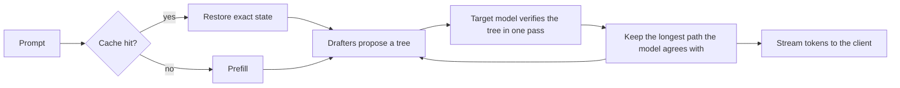

# TandemLLM

TandemLLM is an inference engine for Qwen3.8-27B on one NVIDIA DGX Spark. With its NVFP4 profile it writes about 44 tokens a second for one request, and the text it writes is the text the model writes on its own. Plain decoding on the same box runs at about 13 tok/s.

TandemLLM is a working name, and it says how the engine works. Small drafters guess the next 7 to 15 tokens, and the big model checks all the guesses in one pass. A guess the model agrees with is a free token. At the first wrong guess the model puts in its own token, so nothing a drafter does reaches the output.

## Results

We ran one request at a time on one DGX Spark, against vLLM with its best speculative decoding on the same box:

| weights | TandemLLM | vLLM 0.27.1, best speculation | speed-up |
|-|-|-|-|
| FP8, the vendor checkpoint | 28.4 tok/s | 15.57 tok/s (MTP, 3 tokens) | 1.82x |
| NVFP4 | about 44 tok/s | 25.71 tok/s (best of MTP 2, MTP 3, n-gram) | 1.71x |

How we measured:

- The workload is `serve-single-i256-o256-v1`: 256 prompt tokens, 256 generated tokens, thinking off, temperature 0, seed 42. It sends 50 requests after 3 warm-ups, one at a time, through the same bench runner and the same prompts for both engines.
- A request's speed is `(completion_tokens - 1) / (end-to-end time - time to first token)`. The table shows the mean over the 50 requests.
- vLLM ran as its 0.27.1 container with default settings except the memory share (0.82 for FP8, 0.78 for NVFP4). We tried MTP at 2 and 3 tokens and the n-gram method, and the table shows the fastest.
- TandemLLM ran with its lookup store off, so none of the benchmark's own text could help it. Its release gate also runs every row with a clean store, one that never held the benchmark's text. On the NVFP4 profile the two views agree to within 1 %.
- The two NVFP4 rows do not read the same weights. vLLM reads a published NVFP4 export of the model. TandemLLM reads its own quantised set: MLP, GDN and attention projections at NVFP4 and the output head at FP8 (e4m3). Our quality gate scores ours against the FP8 checkpoint, and [docs/quantisation.md](docs/quantisation.md) has the numbers.
- These are single-request numbers. Parallel requests and long prompts are not in this table.

[docs/measurement.md](docs/measurement.md) explains the method. It also explains why every change runs against the current release in the same hour, 50 requests a side, before it ships.

## What makes it fast

A decode step of a 27B model reads every weight once, and on this board that read is the cost: 15 GB at NVFP4, against about 240 GB/s the GPU can read. The engine does two things about it. It cuts the bytes a step reads, and it makes each step produce about 4 tokens instead of one.



The parts:

- Weights. The loader reads the vendor's FP8 checkpoint as it lies on disk. A quantiser writes NVFP4 copies of the projections, and a quality gate decides whether they ship.
- Kernels. Our own Triton and CUDA kernels run the 4-bit and 8-bit matrix products and the recurrent layers. A row gets the same bits whatever other rows share the batch, up to 32 rows.
- Speculation. Two DFlash2 block drafters (one guesses 7 tokens, one 15), a lookup drafter that copies from the conversation and a text corpus, and a router that picks the block length once per request. The guesses form a tree, and the model verifies the whole tree through all 64 layers, recurrent ones included.
- Caches. The next turn of a conversation resumes from the state the last one left, with no re-reading. Each restore gives back the exact bytes.
- Server. An OpenAI-compatible API. Tool calls come back typed by their JSON schema, structured outputs stay exact under speculation, and a long prefill stops when the client leaves.
- Dashboard. The engine serves its own web page. It shows what each request is doing right now (prefilling at 76 %, thinking, calling `write_file`), and keeps a year of speed and usage.

Start with [docs/architecture.md](docs/architecture.md), a one-page tour. Each of the 12 pages in [docs](docs/README.md) covers one part.

## Quick start

You need a DGX Spark (GB10 GPU, 128 GB of memory shared by CPU and GPU) with Linux, Python 3.11 or newer, PyTorch 2.13 with CUDA 13.0 (and its compiler, for the one kernel that builds on first use), Triton 3.7, transformers 5.12, safetensors and numpy. The engine needs no other package. Run one engine per board: two engines loading side by side run the board out of memory.

Download the checkpoint and the released block drafter:

```bash
hf download Qwen/Qwen3.8-27B-FP8
hf download z-lab/Qwen3.8-27B-DFlash2
```

Build the NVFP4 weights and the FP8 head, then gate them:

```bash
python tools/quant_nvfp4.py stats --corpus bench/calib.txt --out ~/nvfp4/stats-all.pt --tokens 8192
for t in mlp gdn attn; do
  python tools/quant_nvfp4.py quant --mode clip --targets $t --stats ~/nvfp4/stats-all.pt \
      --out ~/nvfp4/$t-clip.safetensors
done
python tools/quant_head.py build --out ~/nvfp4/head-fp8.safetensors --ratios 1.0,0.95,0.90

python tools/quality_gate.py --tokens 2048 --gen 900 \
    --nvfp4 ~/nvfp4/mlp-clip.safetensors,~/nvfp4/gdn-clip.safetensors,~/nvfp4/attn-clip.safetensors
```

Serve with the released drafter:

```bash
python server/app.py --port 8000 --max-len 32768 --drafter dflash2 --dflash2-path greedy \
    --nvfp4 ~/nvfp4/mlp-clip.safetensors,~/nvfp4/gdn-clip.safetensors,~/nvfp4/attn-clip.safetensors \
    --fp8-head ~/nvfp4/head-fp8.safetensors

curl -s localhost:8000/v1/chat/completions -H 'Content-Type: application/json' \
    -d '{"model": "any", "messages": [{"role": "user", "content": "Say hello."}]}'
```

`ops/serve.env` holds the full served setup, with both fine-tuned drafters, the length router, the tree and the corpus, and `ops/start.sh` starts it. The fine-tuned drafters and the corpus are not published yet, so that profile runs only where those files exist. [docs/operations.md](docs/operations.md) covers the service and the safety rules.

## Profiles

A profile is a `serve.env` file: which weights, which drafters, which settings.

| profile | file | weights | single request |
|-|-|-|-|
| NVFP4 (served) | `ops/serve.env` | every projection at NVFP4, FP8 head | about 44 tok/s |
| FP8 | `ops/serve-fp8.env` | the checkpoint's own FP8 projections and BF16 head | 28.4 tok/s |
| balanced | `ops/serve-balanced.env` | NVFP4 MLPs, checkpoint FP8 GDN and attention, FP8 head | not measured yet |

All three run the same drafters and are held to the same exactness gate. [docs/quantisation.md](docs/quantisation.md) says what each weight set costs in quality, in nats of held-out loss.

## Documentation

- [Architecture](docs/architecture.md): the model, the byte budget, the decode loop
- [Quantisation and profiles](docs/quantisation.md)
- [Kernels](docs/kernels.md)
- [Drafters and tree verify](docs/speculative-decoding.md)
- [Exactness](docs/exactness.md): what "lossless" promises, and its one exception
- [Caches](docs/caches.md)
- [Server and API](docs/server.md)
- [Dashboard](docs/dashboard.md)
- [Operations](docs/operations.md)
- [Measurement](docs/measurement.md)
- [Adding a model](docs/adding-a-model.md)
- [Roadmap](docs/roadmap.md)

## Status

This is version `0.1.0-rc10`, a release candidate. It runs on one board (DGX Spark) with one model (Qwen3.8-27B) today. [CHANGELOG.md](CHANGELOG.md) lists the releases.

## Credits

Qwen made the model weights and their reference implementation. z-lab made the base block drafter, DFlash2 for Qwen3.8-27B. The engine runs on PyTorch and Triton over CUDA. We build the lookup corpus from public, permissively licensed text. Everything else in this repository is our own work.

## License

- The engine code is dual-licensed: [AGPL-3.0](LICENSE) for everyone, or a [commercial license](COMMERCIAL-LICENSE.md) from the copyright holder for use without the AGPL's obligations.
- Contributions are accepted under the Contributor License Agreement in [CONTRIBUTING.md](CONTRIBUTING.md), so that both licenses stay possible.
- The documentation in `docs/`, and future paper text, is licensed under [CC BY 4.0](docs/LICENSE).
- This repository contains no model weights. The base model (`Qwen/Qwen3.8-27B` and its FP8 release) and the base drafter (`z-lab/Qwen3.8-27B-DFlash2`) are Apache-2.0. Weights derived from them, such as the NVFP4 overlays and the fine-tuned drafters, carry the Apache-2.0 obligations: keep the attribution and the NOTICE.

© 2026 Khaled Bakeer.
