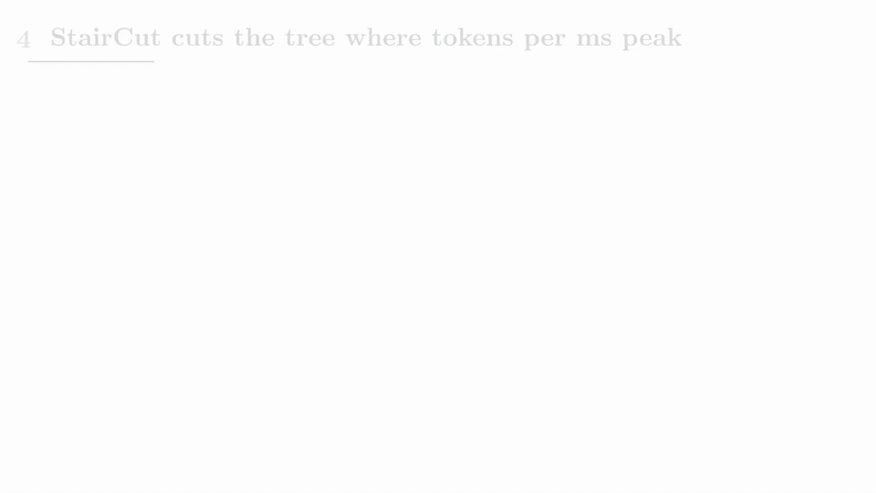
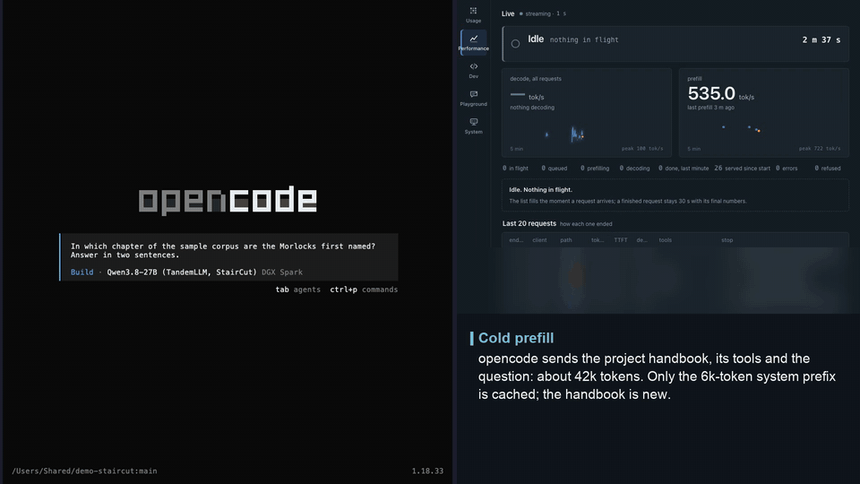
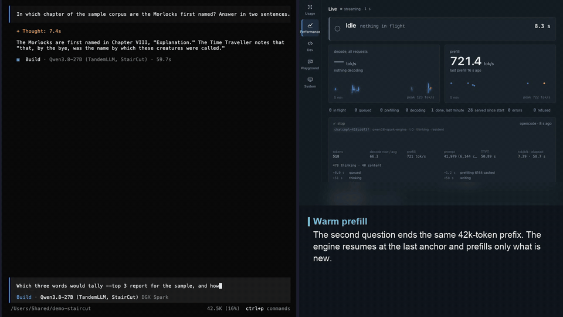
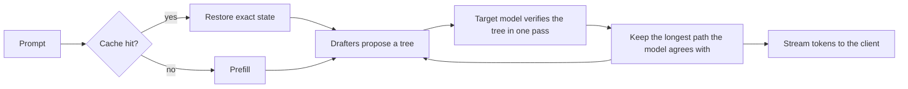

# TandemLLM

TandemLLM is an inference engine for Qwen3.8-27B on one NVIDIA DGX Spark. With the published NVFP4 weights and StairCut on, it writes about 50 tokens a second for one request. Plain greedy decoding on the same box runs at 13.69 tok/s. The text is the model's own greedy text, with one documented exception: where the two best tokens are within one unit in the last place (ulp), the batched verify can round the other way ([docs/exactness.md](docs/exactness.md)).

TandemLLM is a working name, and it says how the engine works. Small drafters guess the next tokens, and the big model checks all the guesses in one pass. A guess the model agrees with is a free token. At the first wrong guess the model puts in its own token, so nothing a drafter does reaches the output.

## See it

| StairCut sizes the draft tree each round | the speed follows the kind of text |
|-|-|
|  |  |
| **first turn of a ~42k-token opencode session: cold prefill** | **next turn: resumed from the cache, prefill starts near the end** |
|  |  |

More clips: thinking and tool calls in [docs/server.md](docs/server.md), a verbatim quotation in [docs/speculative-decoding.md](docs/speculative-decoding.md), the dashboard in [docs/dashboard.md](docs/dashboard.md). The clips were recorded against the served engine on the published NVFP4 weights with StairCut on; sped-up parts are marked in each clip.

## Paper

StairCut, the router that sizes the draft tree each round, is described in:

> Khaled Bakeer. *StairCut: sizing speculative draft trees on a measured verification-cost staircase.* 2026. Zenodo, [10.5281/zenodo.23045275](https://doi.org/10.5281/zenodo.23045275).

The paper measured commit `431ddee` on branch `router-eng169`. StairCut is on `main` from merge commit `c111fa7`, behind flags that are off by default and on in `ops/serve.env`. On the benchmark row below, with the published NVFP4 weights and the persistent lookup store off, the paper reports these means over 50 requests:

| configuration | tok/s |
|-|-|
| StairCut | 49.89 |
| fixed block 8 (the narrow drafter alone) | 47.13 |
| fixed block 16 (the wide drafter alone) | 44.80 |
| plain greedy decoding | 13.69 |

Plain greedy decoding was measured on 28 September on an earlier build; its path with speculation off is unchanged since. On a teacher-forced bench of 25 workloads (fresh text, edits, quotations and copies, 32k context), where every configuration commits the same reference text, StairCut averages 90.45 tok/s against 81.95 for the fixed block 16 and 59.31 for the fixed block 8. On 30 prompts checked against plain greedy decoding, 17 outputs are identical to the end of the answer and 13 diverge at a near tie of at most one ulp ([docs/exactness.md](docs/exactness.md)). A long prompt sent a second time resumes from the cache and reaches its first token in 0.3, 0.6 and 1.1 s at 32k, 64k and 128k tokens, against 44.4, 93.7 and 208.3 s cold ([docs/caches.md](docs/caches.md)). Against Qwen's BF16 release the weights cost +0.0221 nats on prose and +0.0426 on code ([docs/quantisation.md](docs/quantisation.md)).

[CITATION.cff](CITATION.cff) has the citation.

## Results

The Paper section above has the current numbers: StairCut against the same drafter at a fixed block width and against plain greedy decoding, all on the published NVFP4 weights on one DGX Spark.

How we measured:

- The workload is `serve-single-i256-o256-v1`: 256 prompt tokens, 256 generated tokens, thinking off, temperature 0, seed 42. It sends 50 requests after 3 warm-ups, one at a time.
- A request's speed is `(completion_tokens - 1) / (end-to-end time - time to first token)`. The tables show the mean over the 50 requests.
- The lookup drafter's persistent store is off, so none of the benchmark's own text can help. The release gate also runs every row with a clean store, one that never held the benchmark's text.
- These are single-request numbers. Parallel requests are not in them; long prompts are in [docs/caches.md](docs/caches.md).

[docs/measurement.md](docs/measurement.md) explains the method. It also explains why every change runs against the current release in the same hour, 50 requests a side, before it ships.

## What makes it fast

A decode step of a 27B model reads every weight once, and on this board that read is the cost: 15 GB at NVFP4, against about 240 GB/s the GPU can read. The engine does two things about it. It cuts the bytes a step reads, and it makes each step produce about 4.6 tokens instead of one.



The parts:

- Weights. The served set is NVFP4 for every projection, quantised once from Qwen's BF16 release with GPTQ, plus an FP8 (e4m3) output head, loaded over the vendor's FP8 checkpoint. A quality gate against BF16 decides whether a set ships.
- Kernels. Our own Triton and CUDA kernels run the 4-bit and 8-bit matrix products and the recurrent layers. The projection kernels give a row the same bits whatever other rows share the batch, from 1 to 32 rows.
- Speculation. A DFlash2 block drafter that guesses 15 tokens, and a lookup drafter that copies from the conversation and a text corpus. StairCut (`QWEN38_LEN_SWITCH=1 QWEN38_LEN_MODE=wide`, off in the code, on in `ops/serve.env`) cuts every round's tree to the size that maximises expected tokens per millisecond on the measured verify cost. The guesses form a tree, and the model verifies the whole tree through all 64 layers, recurrent ones included. A second, narrow drafter (block 8) is loaded but released at the first round; with the StairCut flags off, the older length router picks one of the two widths per request. [docs/speculative-decoding.md](docs/speculative-decoding.md) describes both.
- Caches. The next turn of a conversation resumes from the state the last one left, with no re-reading. Each restore gives back the stored state bit for bit.
- Server. An OpenAI-compatible API. Tool calls come back typed by their JSON schema, structured-output masks apply to every verified row, and a long prefill stops when the client leaves.
- Dashboard. The engine serves its own web page. It shows what each request is doing right now (prefilling at 76 %, thinking, calling `write_file`), and keeps a year of speed and usage.

Start with [docs/architecture.md](docs/architecture.md), a one-page tour. Each of the 12 pages in [docs](docs/README.md) covers one part.

## Install

One command sets up the served profile, StairCut included, on a DGX Spark:

```bash
curl -fsSL https://raw.githubusercontent.com/0xBakeer/TandemLLM/main/install.sh | bash
```

[install.sh](install.sh) first checks the board: GPU, driver, CUDA compiler, about 70 GB of free disk and 64 GiB of free memory to start. It clones the engine at release `v0.3.0` into `~/TandemLLM/src` and builds a venv with pinned packages. The base checkpoint, the NVFP4 weights and both drafters go to the Hugging Face cache. The config is `~/TandemLLM/run/ops/serve.env`, the release's `ops/serve.env` with this machine's paths. Then it starts the engine, waits for `/health`, runs a smoke test that prints tok/s, and shows how to point an OpenAI client or opencode at it. Run it again to update: it skips finished steps, and downloads resume where they stopped.

| flag | what |
|-|-|
| `--dir DIR` | install directory, default `~/TandemLLM` |
| `--port PORT`, `--host ADDR` | where the API listens, default `127.0.0.1:8000` |
| `--ref REF` | the engine version to check out (any git ref), default `v0.3.0`; `v0.2.0-staircut` is the paper's |
| `--hf-token TOKEN` | a Hugging Face token (`HF_TOKEN` works too) |
| `--no-corpus` | skip the lookup corpus |
| `--no-start` | install and configure, don't start |
| `--systemd` | also install a systemd user unit, `tandemllm.service` |
| `--yes`, `--dry-run`, `--uninstall` | non-interactive, print the steps only, remove the install |

Afterwards, `~/TandemLLM/bin/tandem start|stop|status|smoke|logs` controls the engine.

The dashboard at `http://<host>:8000/dashboard/` opens without a sign-in, so anyone who can reach the port can read it. To require the admin token, put `QSE_DASHBOARD_LOGIN=on` in `~/TandemLLM/run/local.env`, create the token with `QSE_STATE_DIR=~/TandemLLM/state bash ~/TandemLLM/src/ops/make-secrets.sh`, run `~/TandemLLM/bin/tandem restart`, and read it with `grep QSE_ADMIN_TOKEN ~/TandemLLM/state/secrets.env`. [docs/dashboard.md](docs/dashboard.md#signing-in) says what the dashboard shows and has the steps.

The installer builds its lookup corpus from public text: one English and one German Wikipedia shard, plus Python sources from the venv's own packages, about 31 million tokens. The served corpus is not published, and the paper's numbers come from it. With the installer's corpus, or with `--no-corpus`, the lookup drafter proposes different continuations, so speeds can differ from the paper's. We haven't measured by how much. Other CUDA GPUs are best effort: the installer turns off the sm_121a-only skinny kernel there, and StairCut's cost tables come from the Spark.

## Quick start

You need a DGX Spark (GB10 GPU, 128 GB of memory shared by CPU and GPU) with Linux, Python 3.11 (under 3.12 `tests/test_grammar.py` fails), PyTorch 2.13 with CUDA 13.0 (and its compiler, for the one kernel that builds on first use), Triton 3.7, transformers 5.12, safetensors and numpy. The engine needs no other package. Run one engine per board: two engines loading side by side run the board out of memory.

The quickest path uses the published weights and drafters:

```bash
hf download Qwen/Qwen3.8-27B-FP8
hf download 0xBakeer/TandemLLM-Qwen3.8-27B-NVFP4 --local-dir ~/tandem/nvfp4
hf download 0xBakeer/TandemLLM-Qwen3.8-27B-DFlash2-b8 --local-dir ~/tandem/ft-b8
hf download 0xBakeer/TandemLLM-Qwen3.8-27B-DFlash2-b16 --local-dir ~/tandem/ft-b16
```

Then edit the path lines at the top of `ops/serve.env` to match your machine: `REPO` (this checkout), `PY` (a Python with the packages above), `NV=~/tandem/nvfp4/mlp.safetensors,~/tandem/nvfp4/gdn.safetensors,~/tandem/nvfp4/attn.safetensors`, `HEAD=~/tandem/nvfp4/head-fp8.safetensors`, `CKPT8=~/tandem/ft-b8`, `CKPT16=~/tandem/ft-b16` and `CORPUS`. Start it with `bash ops/start.sh`. That is the served profile, StairCut included.

To build the published weight set yourself, quantise from the BF16 release with GPTQ on the NVFP4 grid (about 80 GB of GPU memory with the default `--h-budget-gb 22`, and 25 minutes on an RTX PRO 6000; see [docs/quantisation.md](docs/quantisation.md)), then build the FP8 head:

```bash
hf download Qwen/Qwen3.8-27B
python tools/calib_corpus.py --out ~/calib
python tools/quant_nvfp4.py build --model ~/.cache/huggingface/hub/models--Qwen--Qwen3.8-27B/snapshots --methods gptq --out-dir ~/nvfp4-bf16 \
    --corpus ~/calib/calib-code.txt:80000,~/calib/calib-en.txt:60000,~/calib/calib-de.txt:16000
python tools/quant_head.py build --out ~/nvfp4-bf16/head-fp8.safetensors --ratios 1.0,0.95,0.90
```

The build writes `~/nvfp4-bf16/gptq/{mlp,gdn,attn}.safetensors`. `tools/quality_gate.py --plan` scores them against the BF16 model ([docs/quantisation.md](docs/quantisation.md)). The engine loads them over the FP8 checkpoint (`Qwen/Qwen3.8-27B-FP8`, above), as it does the published files. An older path quantises from the FP8 release with the clip search alone (`tools/quant_nvfp4.py stats` and `quant --mode clip`); it rounds every weight twice and costs more quality, and the same page describes it.

To try the engine with the released base drafter instead of the fine-tuned ones:

```bash
hf download z-lab/Qwen3.8-27B-DFlash2
python server/app.py --port 8000 --max-len 32768 --drafter dflash2 --dflash2-path greedy \
    --nvfp4 ~/nvfp4-bf16/gptq/mlp.safetensors,~/nvfp4-bf16/gptq/gdn.safetensors,~/nvfp4-bf16/gptq/attn.safetensors \
    --fp8-head ~/nvfp4-bf16/head-fp8.safetensors

curl -s localhost:8000/v1/chat/completions -H 'Content-Type: application/json' \
    -d '{"model": "any", "messages": [{"role": "user", "content": "Say hello."}]}'
```

`ops/serve.env` holds the full served setup, with StairCut, the fine-tuned drafters (block 16 drafts; block 8 is loaded and released at the first round), the tree and the corpus, and `ops/start.sh` starts it. The fine-tuned drafters are published on Hugging Face (links below). The lookup corpus of about 38 million tokens is not published; `tools/build_corpus.py` builds one, and without it the lookup drafter copies only from the conversation and the persistent store, so speeds differ from the paper's. [docs/operations.md](docs/operations.md) covers the service and the safety rules.

## Profiles

A profile is a `serve.env` file: which weights, which drafters, which settings.

| profile | file | weights | single request |
|-|-|-|-|
| NVFP4 (served) | `ops/serve.env` | the published set: every projection at NVFP4, FP8 head | 49.89 tok/s with StairCut (paper) |
| FP8 | `ops/serve-fp8.env` | the checkpoint's own FP8 projections and BF16 head | not measured on this release |
| balanced | `ops/serve-balanced.env` | the published set's NVFP4 MLPs and FP8 head, checkpoint FP8 GDN and attention | not measured on this release |

All three run the same drafters and settings and are held to the same exactness gate. The FP8 and balanced profiles source `ops/serve.env`, so they inherit StairCut with its verify prices (`ops/stair-tables-nvfp4.json`), which were measured on the full-NVFP4 profile. The router corrects their level online, but the staircase's shape for these two profiles is not measured, and neither is their speed on this release. [docs/quantisation.md](docs/quantisation.md) says what each weight set costs in quality, in nats of held-out loss.

## Documentation

- [Architecture](docs/architecture.md): the model, the byte budget, the decode loop
- [Quantisation and profiles](docs/quantisation.md)
- [Kernels](docs/kernels.md)
- [Drafters and tree verify](docs/speculative-decoding.md)
- [Exactness](docs/exactness.md): what the engine promises about its text, and the near-tie exception
- [Caches](docs/caches.md)
- [Server and API](docs/server.md)
- [Dashboard](docs/dashboard.md)
- [Operations](docs/operations.md)
- [Measurement](docs/measurement.md)
- [Adding a model](docs/adding-a-model.md)
- [Roadmap](docs/roadmap.md)

## Weights

| repository | what |
|-|-|
| [0xBakeer/TandemLLM-Qwen3.8-27B-NVFP4](https://huggingface.co/0xBakeer/TandemLLM-Qwen3.8-27B-NVFP4) | the NVFP4 overlays and the FP8 head, quantised once from Qwen's BF16 release |
| [0xBakeer/TandemLLM-Qwen3.8-27B-DFlash2-b8](https://huggingface.co/0xBakeer/TandemLLM-Qwen3.8-27B-DFlash2-b8) | the fine-tuned block 8 drafter, loaded by the served profile and released at the first round |
| [0xBakeer/TandemLLM-Qwen3.8-27B-DFlash2-b16](https://huggingface.co/0xBakeer/TandemLLM-Qwen3.8-27B-DFlash2-b16) | the fine-tuned block 16 drafter, the one StairCut runs |

## Status

The current release is `v0.3.0`, which adds image input: chat messages may carry `image_url` parts, and the checkpoint's vision tower encodes them ([docs/server.md](docs/server.md) has the limits). Text requests are unchanged. `v0.2.0-staircut` (merge commit `c111fa7`) is the paper's release: it brought StairCut and turned it on in the served profile. `v0.2.1` changed only the dashboard login, which is now off by default, and docs and config. It runs on one board (DGX Spark) with one model (Qwen3.8-27B) today. [CHANGELOG.md](CHANGELOG.md) lists the releases.

Stopped and archived: this branch also holds our Kolibri-1 work (Aleph Alpha's model on its own NVFP4 weights). It is not maintained and will not be merged; [docs/kolibri.md](docs/kolibri.md) has the measured results and how to run it.

## Credits

Qwen made the model weights and their reference implementation. Inco AI made the base block drafter, DFlash2 for Qwen3.8-27B (`incoai/Qwen3.8-27B-DFlash2`, mirrored as `z-lab/Qwen3.8-27B-DFlash2`). The engine runs on PyTorch and Triton over CUDA. We build the lookup corpus from public, permissively licensed text. Everything else in this repository is our own work.

## License

- The engine code is dual-licensed: [AGPL-3.0-only](LICENSE) (version 3 only; see [NOTICE](NOTICE)) for everyone, or a [commercial license](COMMERCIAL-LICENSE.md) from the copyright holder for use without the AGPL's obligations.
- Contributions are accepted under the Contributor License Agreement in [CONTRIBUTING.md](CONTRIBUTING.md), so that both licenses stay possible.
- The documentation in `docs/` is licensed under [CC BY 4.0](docs/LICENSE).
- This repository contains no model weights. The base model (`Qwen/Qwen3.8-27B` and its FP8 release) and the base drafter (`incoai/Qwen3.8-27B-DFlash2`) are Apache-2.0. The published NVFP4 overlays and fine-tuned drafters are derived from them and are Apache-2.0 too: keep the attribution and the license when you pass them on.

© 2026 Khaled Bakeer.
