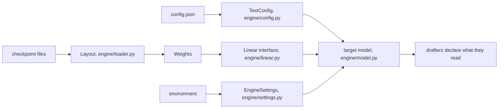

# Adding a model

Today TandemLLM runs one model family: Qwen3.8, a hybrid of Gated DeltaNet and attention layers. This page lists the seams where a new model plugs in, what each one expects, and the tests a new model must pass before its numbers mean anything. Some of the engine is still specific to this family, and the last section says which parts.

## The seams

### Config

`engine/config.py::load_config` reads `config.json` into a `TextConfig` with every size the engine needs, from the layer count to the rotary settings. It also answers which layers are recurrent (`is_linear`, `linear_layers`, `attention_layers`). It accepts a vision-language config (the text model under `text_config`) and a text-only config (the keys at the top level).

A new family either fits `TextConfig` or extends it. The rest of the engine asks `TextConfig`, never the raw JSON.

### Layout

`engine/loader.py::Layout` says how a checkpoint names its tensors, in one place. The engine addresses every tensor by a canonical name (`embed_tokens.weight`, `lm_head.weight`, `norm.weight`, `layers.N.<module>.<proj>`), which is the language model's own naming with the checkpoint's wrapper prefix taken off.

| attribute | what it says |
|-|-|
| `prefixes` | wrapper prefixes to strip, first match wins (`model.language_model.`, then `model.`) |
| `skip_inside`, `skip_start` | tensors the engine never reads, such as a vision tower |
| `mtp_file` | where the checkpoint keeps its prediction head |
| `embed`, `head`, `final_norm` | canonical names of the three model-level tensors |
| `projections` | the projection names a checkpoint may store as FP8 pairs or as plain matrices |

A checkpoint without `lm_head.weight` reads the embedding as its head only when the config says the two are tied. `tests/test_layout.py` builds tiny checkpoints of both kinds on the CPU and checks that they read to the same canonical names. It also pins the served checkpoint's key set: 1,250 language-model keys read, 333 vision keys skipped.

### Weight formats: the Linear interface

Every weight the engine multiplies by implements one small interface (`engine/linear.py`):

    class Linear(Protocol):
        shape: (N, K)
        nbytes: int                 # bytes read per use
        def matmul(x[..., K]) -> [..., N]

| class | format | file |
|-|-|-|
| `FP8Block` | e4m3 codes with one BF16 scale per 128 by 128 block, as the checkpoint stores them | `tools/fp8_linear.py` |
| `NVFP4Block` | e2m1 codes, an e4m3 scale per 16 weights, one fp32 scale | `tools/nvfp4_linear.py` |
| `FP8Head` | e4m3 with one fp32 scale per row, fp32 logits | `tools/head_gemv.py` |
| `BF16Block` | a plain BF16 matrix | `engine/linear.py` |

The model calls `w.matmul(x)` and never asks which format it holds. A new format is a new class with those three members, plus a kernel that keeps the row-invariance rule ([kernels.md](kernels.md)). A BF16 checkpoint loads through the same path: its projections become `BF16Block`s. `tests/test_bf16_load.py` checks that a tiny BF16 checkpoint on disk gives the same forward, bit for bit, as plain tensors.

### Settings

`engine/settings.py` is the registry of every `QWEN38_*` switch the engine reads: its default and the module that reads it. `SETTINGS.get(name)` is the only way engine code reads one, and `tests/test_settings.py` fails on any other read. `EngineSettings(env, prefix)` gives the same reads over another mapping or another prefix, which is how a profile file can be described or a second configuration built in a test.

### What a drafter reads

A drafter reads parts of the target: hidden states at some layers, the embedding, the head. Each drafter declares these through `Drafter.requires()`:

| key | meaning |
|-|-|
| `hidden_size` | the width of the hidden states its taps read |
| `tap_layers` | the target layers it reads |
| `tensors` | target tensors it reads by name, such as the head |
| `vocab_size` | the id space of its proposals |

At load, `engine.drafters.check_target` compares these with the target and refuses a mismatch by name. A DFlash2 drafter trained for another model fails there instead of drafting garbage. The lookup drafter's stores record the tokenizer's sha256 (`engine/tokfp.py`) and refuse to open under another tokenizer.

A new model needs its own block drafter. DFlash2 drafters are trained against one target's hidden states, and a drafter from another model accepts nothing. The lookup drafter works for any model once its corpus is rebuilt with the new tokenizer (`tools/build_corpus.py`).

### The tokenizer and the chat template

The server renders prompts with the model's own chat template and reads the model's own tool-call and reasoning formats. For Qwen3.8 that means the `<think>` block, which the template opens in the prompt, and tool calls in the model's XML form (`server/toolcall.py`). A model with another format needs its own parser behind the same OpenAI output. `tests/fixtures/qwen38_chat_template.jinja` is the fixture the server tests render with.

## The tests a new model must pass

In this order, each on the new model:

1. `tools/refcheck.py`: argmax agreement with the published reference implementation on teacher-forced positions. The reference runs in its own process, because only one model fits on the board at a time. On Qwen3.8 the engine agrees on 99.25 % of 400 positions and on all 242 confident ones.
2. `tools/quality_gate.py` for every quantised weight set ([quantisation.md](quantisation.md)).
3. `tools/verify_spec.py`, the lossless gate, with every drafter ([exactness.md](exactness.md)).
4. The CPU suite, including `tests/test_refactor_gate.py`. That test records the exact bytes of a tiny model's run (every logit and every byte of state after a prefill, a decode, a block verify, a rollback, a tree verify and a commit) and fails if any byte moves. A change that is supposed to change arithmetic re-records the fixture and says why.
5. `ops/gate.sh` and the client smoke set before the numbers are published ([measurement.md](measurement.md)).

## What is still specific to Qwen3.8

- `engine/model.py` implements this family's forward: the Gated DeltaNet layer with its gated norm, attention with a gated output and partial rotary, and the dense MLP. A new family needs its own layer code behind the same verify, commit and cache interfaces. A model with a mixture of experts also needs expert routing inside the verify.
- The recurrent-layer kernels assume Gated DeltaNet's state shape (heads of 128 by 128).
- Tile tables and router prices are measured for this model's shapes on the GB10. A new model or a new board needs its own sweep (`tools/fp8_probe.py --sweep`, `tools/nvfp4_skinny.py`) and its own price curve.
- Some modules read their switches into globals at import. Two engines with different settings cannot share one process yet.
- Runtime names still carry the old project name, from the `QWEN38_` and `QSE_` variable prefixes to the `Qwen38Engine` class. A later release renames them.
