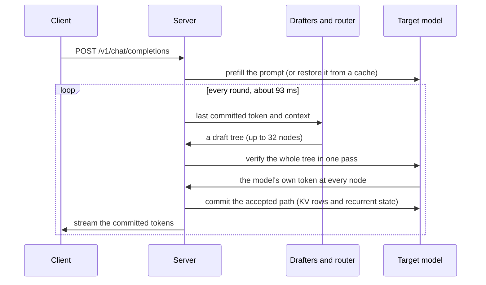
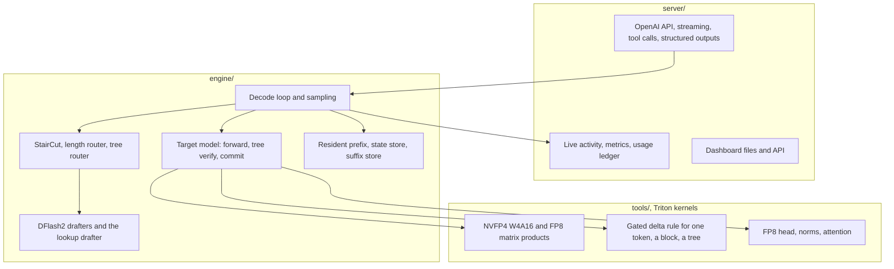

# Architecture

A decode step of Qwen3.8-27B reads about 27 GB of weights in the vendor's FP8 format. The DGX Spark reads memory at 273 GB/s on paper and about 240 GB/s in practice. Those two numbers put a floor of about 100 ms under every step, or 10 tok/s, before any code runs. TandemLLM exists to get under that floor while writing the model's own greedy text, with one documented exception at near ties ([exactness.md](exactness.md)).

It does two things. It cuts the bytes a step reads, from 27 GB to 15 GB. And it makes one step produce about 4.6 tokens: cheap drafters guess, and one pass of the big model checks all the guesses.

## The model

`engine/config.py` reads `config.json` and nothing else. Its text model has 64 decoder layers, hidden size 5120, a dense SiLU MLP of width 17,408 in every layer, and a vocabulary of 248,320 tokens. The model has no mixture of experts. A 0.92 GB vision tower sits in the same checkpoint. The language-model loader skips it by name and `engine/vision.py` loads it on its own for image input ([server.md](server.md#images)).

Every fourth layer (3, 7, 11 and so on up to 63) is full attention, 16 layers in all. Gated DeltaNet fills the other 48. It is a recurrent layer that keeps a fixed-size state instead of a growing KV cache.

| layer kind | count | state per sequence |
|-|-|-|
| Gated DeltaNet | 48 | an fp32 state of 48 heads, each 128 by 128 (3.15 MB) and a 4-wide convolution tail (80 KB), per layer |
| full attention | 16 | BF16 keys and values, 4 KV heads of 256, so 4 KB a token per layer |

That split shapes most of the code. Published work on speculation and caching assumes attention, where undoing a token means moving a pointer back by one row. A recurrent state has absorbed every token and has no inverse, and the engine needs exact ways to undo, branch and restore it. [speculative-decoding.md](speculative-decoding.md) shows the undo and the branch, and [caches.md](caches.md) shows the restore.

## The byte budget

A decode step reads every weight once. This table sums the bytes from the checkpoint's safetensors headers.

| group | bytes a step |
|-|-|
| 48 Gated DeltaNet layers | 18.43 GB |
| 16 attention layers | 5.96 GB |
| the output head, BF16, 248,320 rows by 5,120 | 2.54 GB |
| total, FP8 as shipped | 26.93 GB |

The three MLP projections are 63.6 % of that. Quantising them first, then the rest, moved the budget down in steps, and each step had to pass the quality gate ([quantisation.md](quantisation.md)):

| weight set | bytes a step | floor at 273 GB/s |
|-|-|-|
| FP8 as shipped | 26.93 GB | 98.6 ms |
| NVFP4 MLPs | 19.44 GB | 71.2 ms |
| plus the FP8 (e4m3) head | 18.17 GB | 66.5 ms |
| plus NVFP4 GDN and attention projections | 15.01 GB | 55.0 ms |

State is small beside the weights. The 48 recurrent states are 151 MB together. KV costs 64 KB a token across the 16 attention layers, so 2.1 GB at 32k tokens and about 17 GB at the full 262,144-token context.

## The decode loop

Speed is one fraction:

    tok/s = tokens committed a round / (draft ms + verify ms + commit ms)

A round starts from the last committed token. Next, the drafters propose a tree of guesses after it. One forward pass then runs over the whole tree through all 64 layers. The engine reads the model's own choice at every node and keeps the longest path where the model agrees with the guesses. It always keeps one more token, the model's own choice after the last accepted guess, so a round yields at least one token. Then it commits the state of that path and starts again.

On the served profile (the published NVFP4 set, StairCut on) a round on the benchmark row takes 93.4 ms and commits 4.58 tokens, which gives 49.89 tok/s. Without speculation, the same box writes 13.69 tok/s at 72.8 ms a token (measured on 28 September on an earlier build, whose path with speculation off is unchanged).

## The parts

| part | where | page |
|-|-|-|
| checkpoint layout and loading | `engine/loader.py`, `engine/config.py` | [adding-a-model.md](adding-a-model.md) |
| the quantiser and its gate | `tools/quant_nvfp4.py`, `tools/quant_head.py`, `tools/quality_gate.py` | [quantisation.md](quantisation.md) |
| matrix-product kernels | `tools/nvfp4_*.py`, `tools/fp8_linear.py`, `tools/head_gemv.py` | [kernels.md](kernels.md) |
| recurrent-layer kernels | `tools/gdn_*_kernels.py`, `engine/gdn.py` | [kernels.md](kernels.md) |
| the target model, verify and commit | `engine/model.py`, `engine/tree.py` | [speculative-decoding.md](speculative-decoding.md) |
| drafters | `engine/drafters/` | [speculative-decoding.md](speculative-decoding.md) |
| routers (StairCut, the length router, the tree) | `engine/lenrouter.py`, `engine/router.py`, `engine/prices.py` | [speculative-decoding.md](speculative-decoding.md) |
| sampling and penalties | `engine/sample.py`, `engine/penalty.py` | [exactness.md](exactness.md) |
| structured outputs | `engine/grammar.py` | [server.md](server.md) |
| caches | `engine/cache.py` | [caches.md](caches.md) |
| settings registry | `engine/settings.py` | [operations.md](operations.md) |
| the server | `server/app.py`, `server/stream.py`, `server/toolcall.py` | [server.md](server.md) |
| live activity, metrics, usage | `server/live.py`, `server/activity.py`, `server/metrics.py`, `server/ledger.py` | [dashboard.md](dashboard.md) |
| the dashboard | `dashboard/`, `docs/contract/dashboard-v1/` | [dashboard.md](dashboard.md) |
| service scripts and gate | `ops/` | [operations.md](operations.md) |
| measurement tools | `tools/row3.py`, `tools/block_ab.py`, `tools/verify_spec.py` | [measurement.md](measurement.md) |

## One request, one engine

The engine holds one sequence at a time. Requests wait for the engine lock in a bounded queue (8 by default), and a request that waits longer than the queue timeout gets a 503. Parallel requests in lockstep rounds are the next step on the [roadmap](roadmap.md). The single-request loop is what the numbers on this page describe.
