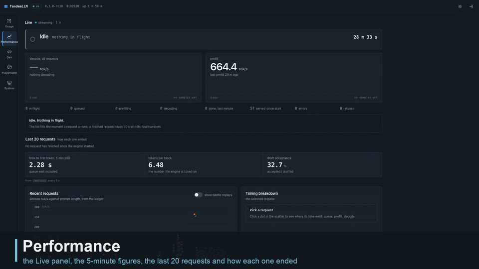

# Dashboard

The engine serves its own web page at `/dashboard/`. It answers the question a log cannot answer at a glance: what is the engine doing right now, for whom, and how fast. All of it is about 45 KB of gzip for the parts every tab loads, and the box needs no Node to serve it.

## Views

| view | what it shows |
|-|-|
| Performance | the Live panel on top, then time to first token, tokens per round and acceptance over the last 5 minutes, then speed history from the usage ledger |
| Usage | a year of tokens as a heatmap, with totals for today, 7 days, 30 days and the year, split into input, cached input, output and reasoning |
| Dev | the live server log, filterable, with a detail view for each request |
| Playground | a streaming chat against the engine's own API, with tools, parameters and the figures of each answer |
| System | the engine's settings and the box's state (memory, GPU, caches), with 30 minutes of history kept in the browser |

## Live activity



*Recorded on the served engine; requests outside the demo session are blurred.*

The Live panel streams `GET /v1/dashboard/live` over server-sent events. While a request runs it gets four events a second, otherwise one.

A line at the top says what the engine is doing now, in the server's own words:

- `Prefilling 36,864 of 48,210 (76 %)`, with the prefill rate and an estimate of the time left;
- `Thinking` or `Writing`, with the decode rate and the tokens so far;
- `Calling tool write_file`, with the size of the arguments written so far;
- `Waiting for client: running tool bash`, between two turns of an agent;
- `Idle` or `Draining`.

When the client's socket closes while the engine still works for it, the line says so in red: "client disconnected 12 s ago".

Under the two big figures (decode and prefill tok/s, each with a 5-minute sparkline) the panel shows tokens per round and milliseconds per round over the last second. Each request in flight gets a row: its state, its client, tokens split into thinking and content, time to first token, the rates, and a timeline strip with one segment per state. When an agent sends its next turn, the row says which request it continues and what the client did in between ("continues chatcmpl-7f3a after 8.4 s, client ran bash").

A list of the last 20 requests says how each one ended, in one sentence: "abandoned by the client after 73 s of silent prefill, 0 tokens sent". Abandoned, failed, timed-out and cancelled requests get a red mark. Refused and rejected ones get an amber mark. A row opens the request's detail in the Dev view.

It also reports on its own stream, "streaming · 4/s", "no update for 3.0 s" or "reconnecting since 4 s". A silent page is never mistaken for an idle engine.

## Where the words come from

Every state and every sentence comes from the server (`server/activity.py`), and the page only formats numbers. Our loop keeps the state it needs anyway, and a sampler reads it once per tick: no statement runs per token for the dashboard's sake. With the activity on and a stream open, the release gate found the text byte-identical and the round time unchanged within noise. `--live-activity off` turns the activity fields off; the counters and rates stay.

A tick costs 410 to 470 µs of CPU at 4 Hz. Each tick is encoded once and sends it to every open stream, and it allows at most 4 streams.

## The contract

`docs/contract/dashboard-v1/` holds a JSON Schema for every JSON response of `/v1/dashboard/*` and a valid example of each. Both sides test against it. The backend's tests validate real responses from the server. The dashboard's tests validate the examples and every response of its mock server (`npm run test:contract` in `dashboard/`). A change to a field bumps `contract_version`, and the contract's [README](contract/dashboard-v1/README.md) lists every change. The live and session endpoints are at version 1.1.

| endpoint | what |
|-|-|
| `GET /v1/dashboard/live` | requests in flight, the engine's state, the last 20 stops, 5 minutes of history |
| `GET /v1/dashboard/summary` | totals for today, 7 days, 30 days and the year |
| `GET /v1/dashboard/usage` | tokens and speed per day or hour, with filters by model and client |
| `GET /v1/dashboard/requests` | finished requests, newest first |
| `GET /v1/dashboard/system` | settings, memory, caches, ledger and disk |
| `GET /v1/dashboard/logs` | the server log, as JSON or as a stream |
| `GET /v1/dashboard/metrics` | the `/metrics` page, for the Performance view's 5-minute figures |
| `GET /v1/dashboard/session` | whether the login is on, and the session's expiry |
| `POST /v1/dashboard/session` | sign in with the admin token (login on only) |

## Access

### Signing in

The dashboard login is off by default. Open `http://<host>:8000/dashboard/` and the dashboard shows its views, with no token and no sign-in page. It works without a `secrets.env`.

With the login off, anyone who can reach the port can read the dashboard:

- per-request counts and timings from the usage ledger: tokens, speeds, cache hits, finish reasons, the kind of client and a short hash of its API key;
- what runs now: each request's state, its client, the names of the tools it calls (not their arguments), and the last 20 stops;
- the server log. No line carries prompt or answer text, unless the server runs with `--log-content`, which lets exception messages quote a request;
- the engine's settings: its command line and every `QWEN38_*` and `QSE_*` variable, with the home directory written as `~`. Variables named like a token, key, secret or password show `<redacted>`, `QSE_ADMIN_TOKEN` among them;
- memory, GPU, cache and disk state, and the Prometheus counters of `/metrics`.

The Playground sends requests through the OpenAI API, which is open with or without the login.

To turn the login on:

1. Set `QSE_DASHBOARD_LOGIN=on`. On an installer setup, add the line to `~/TandemLLM/run/local.env`, which the generated `serve.env` reads last. On a checkout of this repository, set it in `ops/serve.env`.
2. Create the tokens, once, and restart the engine. On an installer setup:

   ```bash
   QSE_STATE_DIR=~/TandemLLM/state bash ~/TandemLLM/src/ops/make-secrets.sh
   ~/TandemLLM/bin/tandem restart
   ```

   On a checkout, `bash ops/make-secrets.sh` writes `~/.qwen38-spark-engine/secrets.env`; restart the engine afterwards. With the login on and no token file, the dashboard API does not exist (404).
3. Read the admin token:

   ```bash
   grep QSE_ADMIN_TOKEN ~/TandemLLM/state/secrets.env        # installer setup
   grep QSE_ADMIN_TOKEN ~/.qwen38-spark-engine/secrets.env   # checkout
   ```
4. Open the dashboard and paste the value after `QSE_ADMIN_TOKEN=` into the sign-in field. The browser keeps the session for 400 days (`QSE_SESSION_S`).

`bash ops/make-secrets.sh --rotate` (with the same `QSE_STATE_DIR`) replaces the token and signs every browser out; restart the engine and sign in with the new one.

### What the login protects

The login decides `/v1/dashboard/*` and nothing else. The static files are public in both modes and hold no data. With the login on, everything under `/v1/dashboard/` needs the admin token or a session. Signing in with the token sets an HttpOnly, SameSite=Strict cookie, signed with a key derived from the token, so rotating the token (`ops/make-secrets.sh --rotate`) ends every session. Five failed sign-ins a minute from one address get a 429.

In both modes, `/metrics` and the full `/health` need the metrics or the admin token, and `GET /v1/cache/stats` the admin token; a dashboard session opens them too, when the login is on. The one route that writes, `POST /v1/cache/clear`, takes only the admin token as a bearer header, never the cookie. Requests from the box itself (loopback, no proxy headers) need none of these tokens. The dashboard API only reads.

This page is meant for a local network. Behind a reverse proxy that faces the internet, turn the login on.

## Usage ledger

`server/ledger.py` writes one SQLite row per request: the model, the kind of client (curl, an OpenAI SDK, opencode, the dashboard), token counts, timings, draft acceptance and the finish reason. It never stores prompt or answer text. Usage and Performance read it through the dashboard API. `--usage-ledger PATH` turns it on, and `--usage-retention-days` bounds it (at least a year plus a margin, so the Usage view has its year). A benchmark server started without the flag writes nothing.

## Building and testing

The app is written in TypeScript with Lit components and built by Vite. Its charts are hand-drawn SVG, and it loads nothing from a CDN. `dashboard/dist/` is committed, and the server serves it from there.

```bash
cd dashboard
npm ci
npm run dev:mock        # the app against a mock engine, token "mock" (?mock=nologin: the login off)
npm test                # unit, contract and build tests
npm run build           # type-check and build dist/
npx playwright test     # end-to-end, Chromium and WebKit, desktop and phone
```

A mock engine can play scenarios for the Live panel (an agent turn with a chunked prefill and a tool call, a client that leaves during a prefill, one request per stop reason) and failure modes (expired session, server errors, dropped streams). Those end-to-end suites also run against `server/app.py --fake-engine`, which serves the real API with a scripted engine and no GPU. [dashboard/README.md](../dashboard/README.md) has the developer details.
