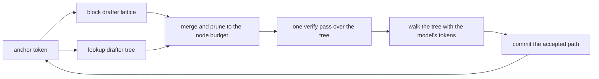

# Drafters and tree verify

A verify of 16 tree nodes costs about the same as a verify of 8. On the served NVFP4 profile the measured prices are 77.9 ms for 8 nodes, 78.9 ms for 16, 87.0 ms for 24 and 97.0 ms for 32. That flat curve is the reason this engine speculates at all: the model's forward pass is bound by reading weights, and extra rows in the same pass are nearly free. TandemLLM therefore lets cheap drafters guess many tokens and checks them all at once.

This page covers the drafters, how their guesses become one tree, how the tree is verified through recurrent layers, and how the router decides what to spend.

## The round

Each round has four steps.

1. Draft. The block drafter proposes a block of tokens, and the lookup drafter proposes continuations it has seen before. The router merges them into one draft tree of at most 32 nodes.
2. Verify. One forward pass of the target model runs over the whole tree, and reads the model's own next token at every node.
3. Accept. Walk down from the root. At each node take the model's token, and move to the child that carries it. Stop where no child carries it. The model's token at the stopping point is kept too, so a round yields at least one token.
4. Commit. Keep the KV rows and the recurrent state of the accepted path, and drop the rest.

On the served profile a round takes about 92 ms and commits about 4 tokens.

## The block drafter

`engine/drafters/dflash2.py` runs DFlash2, a small drafter that proposes a whole block of tokens at once. It has five decoder layers of its own (hidden size 5120) and reads five hidden states of the target (the residual stream entering layers 5, 19, 33, 47 and 61), fused into one input. It has no embedding and no head: it borrows the target's embedding and output head. Inside a block every row attends to every other row, which is what lets it guess 15 tokens in one pass instead of 15 chained steps.

The engine holds two fine-tunes of the released drafter, trained on the target's own output. One proposes 7 tokens a block (trained at block 8), the other 15 (trained at block 16). A draft moves about 6 GB (3.6 GB of drafter layers plus one read of the head for all rows), about 25 ms.

The drafter's head gives the top 16 candidates per slot, and a small bigram selector scores how each candidate follows the one before. That is a lattice of 7 or 15 slots by 16 candidates. The greedy path through it becomes the spine of the tree, and the next-best candidates become branches.

## The lookup drafter

`engine/drafters/ngram.py` copies text instead of predicting it. It looks for the longest match of the last few tokens in three places:

- the request itself, prompt and output so far (orders 2 to 8);
- a corpus of about 38 million tokens of public text, memory-mapped with a suffix array;
- the persistent suffix store, a log of what this engine has read and written before ([caches.md](caches.md)).

Every continuation found is a vote, and the votes form a tree whose node scores are path probabilities. A lookup costs about 0.2 ms, against about 25 ms for the block drafter. On fresh prose it rarely fires. On an edit of a file already in the context, or a quotation, it can commit 15 tokens in a round.

It fires only when the tree it would propose is worth its verify cost. A drafter that proposes on every step and is usually wrong costs the round, because the alternative on a declined step is the block drafter.

After two wide rounds in a row that commit their whole width, the lookup drafter may propose one deep chain of up to 32 rows (`QWEN38_DEEP`). On an editing workload that raised the accepted tokens per round from 12.6 to 15.75.

## The length router

Which block width wins depends on the text rather than the model. On a quotation the wide drafter commits 14.9 tokens a round against 8.0 for the narrow one. On fresh prose the narrow one does as well, 2.7 against 2.6, for less work.

`engine/lenrouter.py` decides once per request. It runs four wide rounds first. A wide round prices both widths at once, because a narrow block is a prefix of a wide one, and the target's token at row i does not depend on rows after i. Where that says the narrow width still has room, it runs up to four narrow probes, because the narrow drafter is a different checkpoint and drafts its own 7 slots better than a cut-down wide block. Then it decides and keeps the decision for the rest of the request.

It decides once because switching costs acceptance. A drafter keeps its own cache of the context, and a switched-in drafter starts behind. A schedule that alternated the two widths as often as a per-round router, while knowing nothing, lost 3 % on chat, 10 % on code and 18 % on a quotation against never switching. Once the decision is made, the losing drafter is released (`DROP_IDLE=1`) and stops syncing, which added a median 3.2 % on a five-workload bench.

## The node count, calculated each round: StairCut (optional)

`QWEN38_LEN_SWITCH=1 QWEN38_LEN_MODE=wide` (StairCut) replaces the length router's decision with a calculation. It is off by default in the code; `ops/serve.env` turns it on for the served profile. Every round drafts with the wide drafter and builds four candidates at up to 31 nodes: its lattice tree, its chain, the lookup tree and their merge. Each candidate is then cut to the node count that maximises its expected committed tokens per millisecond:

    (1 + sum of q over the kept nodes) / (verify(rows) + draft + commit)

A node's `q` is its path probability from the drafter's lattice (read at temperature 1.4), or the lookup's vote share, scaled by the calibration the router already learns online, and capped at 1. Nodes are admitted in the order of the drafter's own score, each with the ancestors it needs, and the expected gain counts at most one token per kept node (`min(sum q, n)`). The price of a tree is verify(rows) + draft + commit; a chain pays the rollback instead of the commit, weighted by the chance that it is rejected. The verify price is a staircase, not a line, so the router tries every count instead of a search that assumes a smooth cost. A cut ends at 7, 15, 23 or 31 nodes (8, 16, 24 or 32 rows) or at the whole candidate, so other sizes occur when a candidate is smaller. The draft cost is the drafter's own measured time at the current context length, because the drafter reads the whole context; it is learned online, per context class. `learn_block=True` (off) also learns a multiplicative correction per block shape from measured round times; it was noise-driven on the box and is not used.

`QWEN38_STAIR_TABLES` names a JSON file of verify prices by context length, chain and tree apart (`tools/verify_curve.py` at a few lengths). At 32k a 24-row tree costs about 16 ms more than a 16-row one against 9 ms at 1k, and a tree costs 2 to 4 ms more than a chain of the same rows. `QWEN38_STAIR_RHO` names a prior for the lookup's continuation rate on 8-token matches (`ops/lookup-rho.json`, counted on held-out traces; its provenance is in the file), in place of the fixed decay of 1/1.6 a level, which lets a long verbatim copy keep its whole line. The rate is a Beta-binomial per (source, match length, copy-run bin), and the router updates it online against every committed block, halving the counts past 4,000 trials. `QWEN38_STAIR_SKIP=1` decides whether to draft the head at all on the same prices, but only once a copy run has started: on a copy round the lookup line alone often wins, and at 32k a draft costs more than at 1k.

What the router learns online (the draft cost per context class, the calibration, the copy counts) belongs to the router object. The server keeps one router for its whole life, so what one request teaches reaches the next; `router.reset()` clears the per-text evidence (the arms' acceptance, the calibration) and keeps the costs and the copy counts. `tools/forced_bench.py` also keeps one router per configuration for a whole run, while `tools/verify_spec.py` builds a new one for every prompt.

The router releases the narrow drafter at the first round. With the node count calculated, the wide drafter's lattice cut to 16 nodes is a bush near the root on fresh text and a long line on copies, and the narrow drafter has nothing left to add. `tools/router_replay.py` replays these policies exactly on recorded lattices of both drafters, and `tools/forced_bench.py` measures them on the box on one reference text, so that different verify shapes, which move bf16 ties, compare on the same text.

## Building the tree

`engine/router.py` merges the block drafter's lattice and the lookup tree into one `DraftTree` (`engine/tree.py`), where a shared prefix becomes a shared node. It then prunes to a node budget. A node stays only while its expected gain in accepted tokens pays for its share of the verify cost, and that cost comes from the measured price curve above (`QWEN38_TREE_MS`, or a price table from `ops/prices.json`). The served budget is 16 nodes for either drafter. The wide drafter gets 24 once the request has committed 32 tokens, so a short answer never pays for branches it cannot use. A deep chain may use up to 32 rows.

The router's cost estimates are learned in the loop. It scores the lookup tree against the tokens the target actually wrote on every round, chosen or not, so its calibration settles before the lookup drafter has had a turn.

## Tree verify through recurrent layers

Verifying a tree through attention layers is known work: give each node an attention mask of its ancestors and a position equal to its depth. The 48 Gated DeltaNet layers are harder. Their state after node t is the state after t's parent, updated by t, and a plain left-to-right walk overwrites the parent's state before t's sibling needs it.

`engine/tree.py` stores a tree in depth-first pre-order: every node's parent has a lower index, and every subtree is a contiguous range. In that order the ancestor relation is part of the strict lower triangle, and every prefix operation of a chain verify has an exact tree counterpart:

| chain | tree |
|-|-|
| causal mask | the committed prefix plus the node's ancestors |
| position = index | position = depth, so two siblings share a position |
| the convolution slides over neighbours | it gathers each node's 3 nearest ancestors |
| cumulative gate along the sequence | the sum of gates along the node's path |
| the delta rule's lower-triangular solve | the same solve on the ancestor relation |
| accept a prefix, roll back to a length | accept a path, commit it by a gather |

The state after any accepted path can be written from quantities the verify already computed. Let `S0` be the state before the round, and for each node on the path let `k` be its key, `u` its pseudo-value and `gc` its cumulative gate. Then

    S_path = exp(gc_last) * S0 + sum over t on the path of exp(gc_last - gc_t) * k_t (x) u_t

`u_t` depends only on t's own path, because the inverse of an ancestor-masked matrix is ancestor-masked too. This formula holds for every root-to-node path, not only for prefixes. The commit is therefore one read of the state and one small matrix product per layer, and it reads no weights. For a chain the same identity is the rollback: keeping the first n tokens of a block is the path of length n.

The KV side is simpler. The cache holds every node at its depth-first slot, and a commit gathers the accepted rows down into place.

## Sampling

Greedy requests (temperature 0) take the path above. A sampled request stays exact in distribution: the target draws its own token at each node, and a drafted token survives exactly while the draw lands on it. For a drafter that proposes one fixed token this is the standard rejection sampler, with no second draw. With `--sampled-tree det` a sampled request keeps the tree, and on a five-workload bench at temperature 0.7 that raised tokens a round from about 4.1 to about 5.3 (19 to 21 % more tok/s).

A request with a `seed` draws with noise keyed by position (the Gumbel-max trick), so the same seed gives the same text whatever the drafters and the router did. [exactness.md](exactness.md) covers both.

## Reasoning

The model thinks inside `<think>` tags. A reasoning budget (`--think-budget`, `max_reasoning_tokens` or `reasoning_effort`) closes the block when it is spent. The server appends the vendor's closing sentence and `</think>`, runs those tokens through the engine at their real positions, and the model answers from there. The stall detector (`--think-stall`, on by default) closes it the same way when the reasoning starts to loop. Both change the answer, and both are visible in the response.

## Knobs

| knob | what |
|-|-|
| `--drafter lenrouter`, `--dflash2-ckpt`, `--dflash2-ckpt16` | the two block drafters and the length router |
| `--len-fixed 8\|16`, `--len-latch` | pin one width, or decide once per request (default) |
| `--drop-idle` | release the drafter that lost the decision |
| `--tree`, `--budget`, `QWEN38_TREE_NODES`, `QWEN38_TREE_NODES_NARROW`, `QWEN38_TREE_WIDE_AFTER` | the tree and its node budgets |
| `QWEN38_TREE_MS`, `--price-table` | the verify price curve the router plans with |
| `--corpus`, `--suffix-store` | the lookup drafter's corpus and persistent store |
| `QWEN38_DEEP`, `QWEN38_DEEP_AFTER` | the deep chain after long accepted paths |
| `QWEN38_LEN_SWITCH=1`, `QWEN38_LEN_MODE=wide` | the node count calculated each round, wide drafter only (off by default) |
| `QWEN38_STAIR_TABLES`, `QWEN38_STAIR_RHO`, `QWEN38_STAIR_SKIP` | verify prices by context length, the lookup's continuation rates, and the head-skip rule on the same prices, for that mode |
| `QWEN38_LATCH_PRICE=1` | the per-request decision priced on the verify curve (off by default) |
| `--sampled-tree det\|mixed`, `QWEN38_DRAFT_TEMP` | sampled requests on the tree, and the drafter's temperature |
| `--think-budget`, `--reasoning-effort`, `--think-stall` | the reasoning controls |
